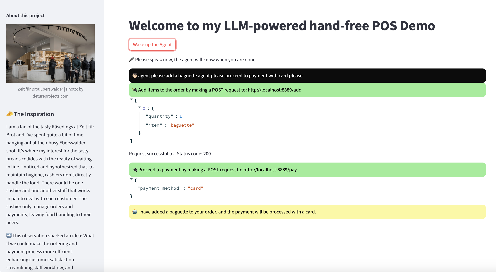

# 🥖 Effortless Hands-free Checkout: A POS Upgrade with LLM Agent 🚀

## 🧀 The Inspiration
I am a fan of the tasty Käsedings at Zeit für Brot and I've spent quite a bit of time hanging out at their busy Eberswalder spot. It's where my interest for the tasty breads collides with the reality of waiting in line.

I noticed and hypothesized that, to maintain hygiene, cashiers don't directly handle the food. There would be one cashier and one another staff that works in pair to deal with each customer. The cashier only manage orders and payments, leaving food handling to their peers.

➡️ This observation sparked an idea: What if we could make the ordering and payment process more efficient, enhancing customer satisfaction, streamlining staff workflow, and ultimately boosting Zeit für Brot's revenue (_sorry for the buzz words_)?

## 💡 The Solution: The Integration of an LLM-agent
This solution proposes to integrate a custom LLM agent directly into the Point of Sale (POS) system. The agent will translate the staff's orders into API requests, registering items in the POS system without manual entry.

## Workflow Simplified:
👩‍💼 Staff-Customer Interaction: A staff takes an order from a customer, speaking into their headset. Notice the "agent" signpost, allowing the LLM agent to differentiate between casual conversation and an official prompt.

➡️ **Example 1:**  
"Agent, take a new order: a baguette, a Käsedings, an egg burger, a cappuccino, and two cinnamon rolls."
  
➡️ **Example 2 (more complex with mixed-up conversation between 2 customers and real orders with the staff):** 
"Do you want to get an espresso and two cinnamon rolls? I don't know?  
OK, I'll decide then. I'll get a baguette, a cappuccino, and two cheese cakes.  
Agent, add a baguette, a cappuccino, and two cheese cakes please. 
Sorry I changed my mind, I won't get the baguette. 
Agent, remove the baguette please."

🤖 LLM Agent Action: The agent processes this speech, generating an API request to register the order.

In case of correction: If there's a change in the order, the staff can proceed with: "Agent, remove one cinnamon roll." The agent will adjust the order accordingly.

💳 Seamless Payment: Upon finalizing the order, "Agent, proceed to payment with QR code" prompts the agent to initiate the payment process, creating a smooth end-to-end transaction.

## 🚀 Give it a try
You can try the PoC Demo here.
