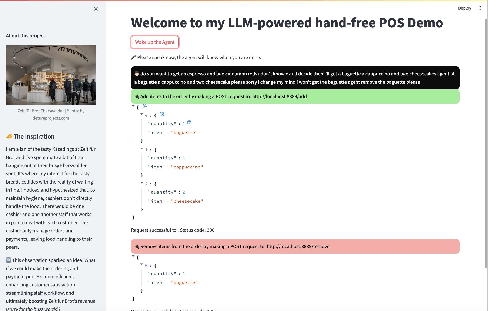
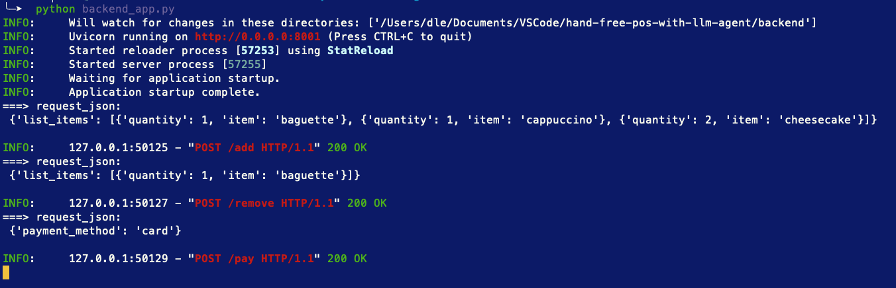

# 🥖 A practical use case of custom LLM Agents: Hands-free POS 🚀

[](https://www.youtube.com/watch?v=4dHBJDix9Is "Click to watch the video")


## 🧀 The Inspiration
I am a fan of the tasty Käsedings at Zeit für Brot and I've spent quite a bit of time hanging out at their busy Eberswalder spot. It's where my interest in the tasty breads collides with the reality of waiting in line.

I noticed and hypothesized that, to maintain hygiene, cashiers don't directly handle the food. There would be one cashier and one other staff working in a pair to deal with customers. The cashiers only manage orders and payments, leaving food handling to their peers.

➡️ This observation sparked an idea: What if we could make the ordering and payment process more efficient, enhancing customer satisfaction, streamlining staff workflow, and ultimately boosting Zeit für Brot's revenue (_sorry for the buzzwords_)?

## 💡 The Solution: The Integration of an LLM-agent
This solution proposes integrating a custom LLM agent into the Point of Sale (POS) system. The agent will translate the staff's orders into API requests, registering items in the POS system without manual entry.

## Workflow Simplified:
👩‍💼 Staff-Customer Interaction: A staff takes an order from a customer, speaking into their headset. Notice the "agent" signpost, allowing the LLM agent to differentiate between casual conversation and an official prompt.

➡️ **Example 1:** <br>
"Agent, take a new order: a baguette, a Käsedings, an egg burger, a cappuccino, and two cinnamon rolls."

➡️ **Example 2 (more complex with a mixed-up conversation between 2 customers and real orders with the staff):** <br>

```markdown
- Customer A: Do you want to get an espresso and two cinnamon rolls?
- Customer B: I don’t know.
- Customer A: OK, I’ll decide then. I’ll get a baguette, a cappuccino, and two cheesecakes.
- Staff: Agent, add a baguette, a cappuccino, and two cheesecakes, please.
- Customer A: Sorry I changed my mind, I won’t get the baguette.
- Staff: Agent, remove the baguette, please.
- Staff: Agent, proceed to payment by card, please.
```



The API log shows the agent's actions in response to the staff's speech.



- The agent processes this speech, generating an API request to register the order.

- In case of correction: If there's a change in the order, the staff can proceed with: "Agent, remove one cinnamon roll." The agent will adjust the order accordingly.

- Upon finalizing the order, "Agent, proceed to payment with QR codes / cards please" prompts the agent to initiate the payment process, creating a smooth end-to-end transaction.

## 🚀 Give it a try
You can try the PoC Demo [here](http://18.199.129.28:8002/).
